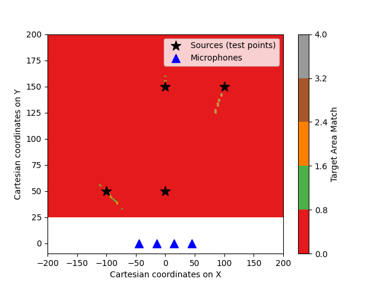

# 1D CNN Multi-Source Sound Localization


## Introduction & The Problem
Locating multiple active acoustic sources simultaneously via an array of microphones introduces severe predictive instabilities, primarily due to "label swapping." If two sources are at similar distances, slight fluctuations in a model’s predictions during training can cause their relative ordering to flip continuously. Consequently, at loss computation time, the correspondence between the predictions and the ground truth is destroyed, yielding massive, unstable penalties that confuse the network and derail the learning curve.

To resolve this, this project abandons fixed heuristic ordering and instead implements a 1D [Convolutional Neural Network (CNN)](https://en.wikipedia.org/wiki/Convolutional_neural_network) equipped with [Permutation Invariant Training (PIT)](https://en.wikipedia.org/wiki/Permutation)[cite: 5]. In PIT, the network computes the loss for all possible permutations of assignments between the predicted outputs and the ground truth targets, backpropagating the error using only the permutation that yields the minimum loss[cite: 5].

## The Prerequisites (Acoustic Quantization & Receptive Fields)
Before optimizing the CNN, the physical limitations of the acoustic environment were mathematically quantified. 

### Spatial Quantization Limit
Operating at a [sampling rate](https://en.wikipedia.org/wiki/Sampling_(signal_processing)) of 48kHz, the absolute theoretical threshold resolution limit was calculated to be **7.15 mm**[cite: 5]. If the sound source moves a distance smaller than this limit, the change in the time delay is just too brief to cross into an adjacent digital sample bucket, making movements less than 7.15 mm physically "invisible" to the model[cite: 5].



### Effective Receptive Field
Furthermore, the network's theoretical [Receptive Field](https://en.wikipedia.org/wiki/Receptive_field) was calculated to be 19[cite: 5]. However, experimental validation demonstrated a divergence from the linear assumption, proving instead that the effective radius grows proportionally to the square root of the depth ($\sigma \propto \sqrt{L}$)[cite: 5]. 

## The Results
By the book, there is often a strong inverse correlation between recording volume (amplitude) and localization error[cite: 5]. Experimental results across this project demonstrated that when a sound is louder, the acoustic sensors capture a cleaner signal, driving down the predictive error[cite: 5].

Following rigorous hyperparameter adjustments—including the adoption of dynamic masks, custom `AudioPool` operations to avoid noisy peak artifacts, and PIT—the model successfully broke through its accuracy plateaus[cite: 5]. 

**Final Unseen Test Set Performance:**
*   **1 Acoustic Source:** 0.2633 MSE (70.43 cm error)[cite: 5]
*   **2 Acoustic Sources:** 0.2605 MSE (70.41 cm error)[cite: 5]
*   **3 Acoustic Sources:** 0.2635 MSE (71.11 cm error)[cite: 5]

Without a shadow of a doubt, these figures prove the model can reliably track up to three active sources simultaneously without suffering severe performance degradation[cite: 5].

### Acoustic Volume vs. Localization Error
A full simulation of continuous recordings revealed a dynamic correlation between sound volume (RMS) and estimation error[cite: 5]. By the book, there is often a strong inverse correlation between recording volume and localization error because louder sounds allow sensors to capture cleaner, stronger signals[cite: 5]. This statement held true in practice, though with nuanced variations: a visible positive correlation occasionally shifted to an inverse correlation depending on sudden RMS variations[cite: 5]. For instance, achieving a medium-height RMS peak of 0.22 at 1.6s led to a significant decrease in localization error, whereas a double-peak RMS body of 0.15 at 8.7s drastically increased the error[cite: 5]. This confirms that localization stability heavily depends upon how well the model is trained to handle sudden RMS variations over time[cite: 5].


### Training Evolution (Single Source)


### Overall Multi-Source Convergence


---

## Code Execution
To get direct access to the model, the custom dataloaders, and the visualization tools, clone the repository and execute the `exercise_3.py` script.

Programmatically, the execution workflow is as follows:

```bash
# Clone the repository and navigate to the directory
cd Your-Repository-Name-Here

# Install dependencies
py -m pip install -r requirements.txt

# Execute the main script
py exercise_3.py --load